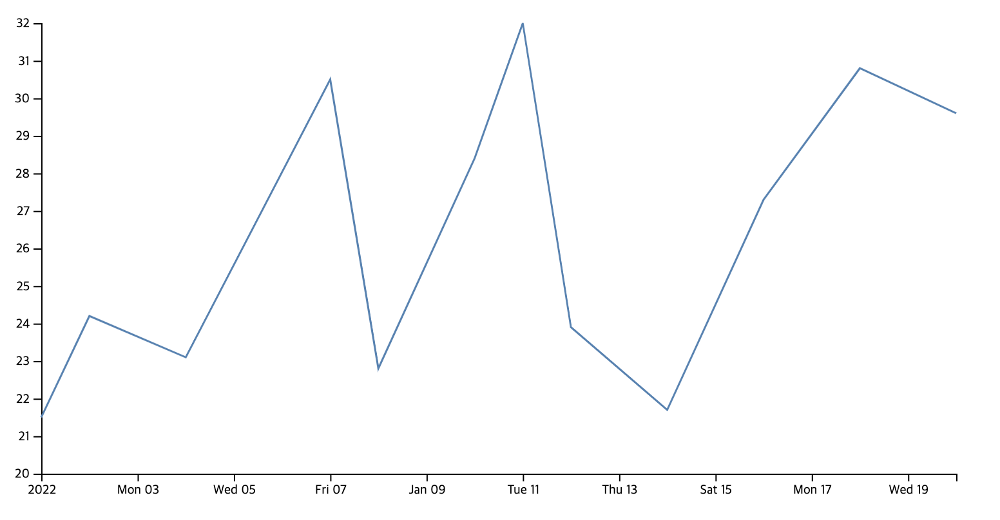
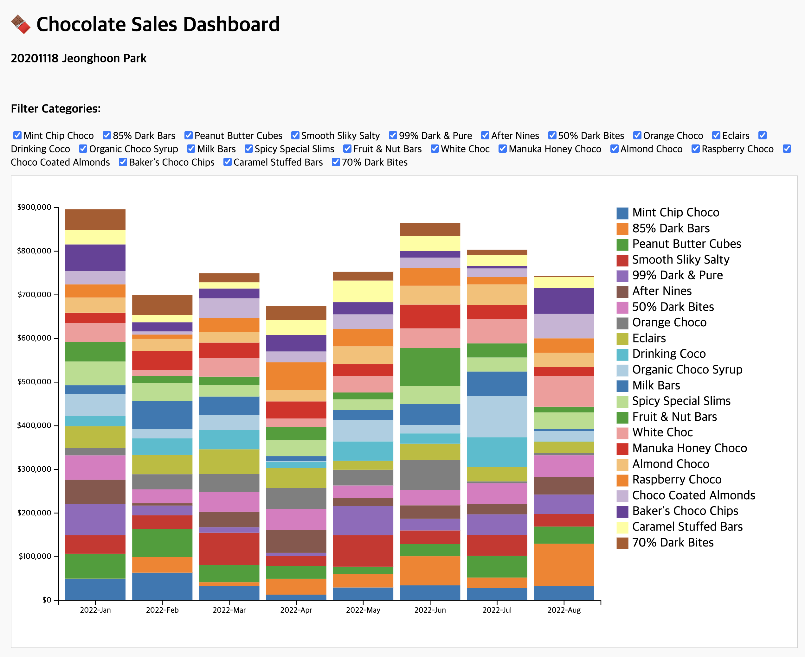

# Information Visualization
UNIST CSE468 Information Visualization

<br>

## Contents

### [Assignment2-1] Drawing Kirby with D3.js


- [Demo](https://hoonably.github.io/information-visualization/assignment_2/1-1/assignment1-1)  
- [Source Code](https://github.com/hoonably/information-visualization/tree/main/assignment_2/1-1/)


### [Assignment2-2] Data Processing with JavaScript 


- [Demo](https://hoonably.github.io/information-visualization/assignment_2/1-2/assignment1-2)
- [Source Code](https://github.com/hoonably/information-visualization/tree/main/assignment_2/1-2/)
  
### [Assignment3]
- [Demo](https://hoonably.github.io/information-visualization/assignment_3)
- [Source Code](https://github.com/hoonably/information-visualization/tree/main/assignment_3/)

```bash
cd assignment_3
npm install
npm start
```
Then you can see  at [http://localhost:3000](http://localhost:3000)

### [Excercise1] Chocolate Sales Visualization 


- [Demo](https://hoonably.github.io/information-visualization/excercise_1/)
- [Source Code](https://github.com/hoonably/information-visualization/tree/main/excercise_1/)

### [Excercise2] Connected Multi-View Dashboard
- [Demo](https://hoonably.github.io/information-visualization/excercise_2/)
- [Source Code](https://github.com/hoonably/information-visualization/tree/main/excercise_2/)

### [Midterm] 
- [Demo]()
- [Source Code]()
  
### [Final] 
- [Demo]()
- [Source Code]()
