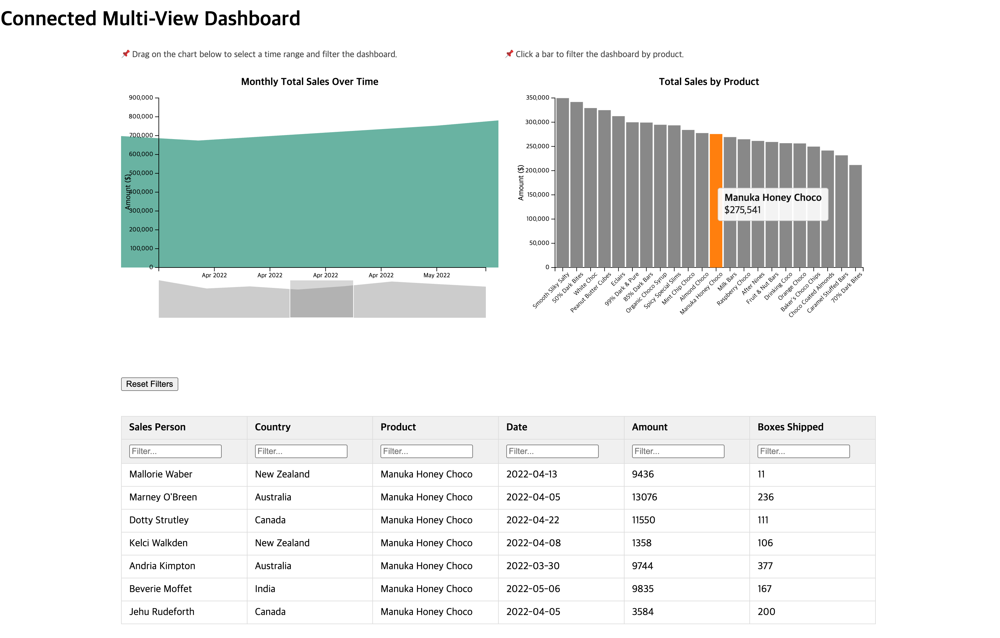
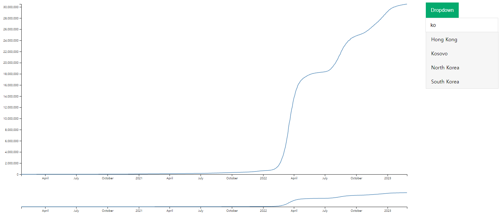

# Information Visualization
UNIST CSE468 Information Visualization

<br>

## [Assignment 2-1] Drawing Kirby with D3.js


* 🧾 [Source Code](https://github.com/hoonably/information-visualization/tree/main/assignment_2/1-1/)
* 📌 [Live Demo](https://hoonably.github.io/information-visualization/assignment_2/1-1/assignment1-1)

<br>

## [Assignment 2-2] Data Processing with JavaScript


* 🧾 [Source Code](https://github.com/hoonably/information-visualization/tree/main/assignment_2/1-2/)
* 📌 [Live Demo](https://hoonably.github.io/information-visualization/assignment_2/1-2/assignment1-2)

<br>

## [Assignment 3] Stacked Bar Chart of Vaccination Rates in Top 15 Asian Countries


* 🧾 [Source Code](https://github.com/hoonably/information-visualization/tree/main/assignment_3/)
* 📌 No live demo available because this project requires a local development server using Node.js and Express.

To run locally:

```bash
# Navigate to the project directory
cd assignment_3
# Install dependencies
npm install
# Start the development server
npm start
```

Then open your browser and visit [http://localhost:3000](http://localhost:3000) to view the visualization.

<br>

## [Excercise 1] Chocolate Sales Visualization 


* 🧾 [Source Code](https://github.com/hoonably/information-visualization/tree/main/excercise_1/)
* 📌 [Live Demo](https://hoonably.github.io/information-visualization/excercise_1/)

<br>

## [Excercise 2] Connected Multi-View Dashboard


* 🧾 [Source Code](https://github.com/hoonably/information-visualization/tree/main/excercise_2/)
* 📌 [Live Demo](https://hoonably.github.io/information-visualization/excercise_2)

<br>

## [Midterm 1] Fix the Errors in the Multiple-Line Chart implementation


* 🧾 [Source Code](https://github.com/hoonably/information-visualization/tree/main/Midterm/Prob1/)
* 📌 No live demo available because this project requires a local development server using Node.js and Express.

To run locally:

```bash
# Navigate to the project directory
cd Midterm/Prob1
# Install dependencies
npm install
# Start the development server
npm start
```

Then open your browser and visit [http://localhost:3000](http://localhost:3000) to view the visualization.

<br>

## [Midterm 2] Drawing Bubble Chart


* 🧾 [Source Code](https://github.com/hoonably/information-visualization/tree/main/Midterm/Prob2/)
* 📌 No live demo available because this project requires a local development server using Node.js and Express.

To run locally:

```bash
# Navigate to the project directory
cd Midterm/Prob2
# Install dependencies
npm install
# Start the development server
npm start
```

Then open your browser and visit [http://localhost:3000](http://localhost:3000) to view the visualization.

<br>

## [Midterm 1] Fix the Errors in the Multiple-Line Chart implementation


* 🧾 [Source Code](https://github.com/hoonably/information-visualization/tree/main/Midterm/Prob1/)
* 📌 No live demo available because this project requires a local development server using Node.js and Express.

To run locally:

```bash
# Navigate to the project directory
cd Midterm/Prob1
# Install dependencies
npm install
# Start the development server
npm start
```

Then open your browser and visit [http://localhost:3000](http://localhost:3000) to view the visualization.

<br>

## [FinalExam] Implement Dropdown and Focus+Context line chart with Brush interaction

<br>


* 🧾 [Source Code](https://github.com/hoonably/information-visualization/tree/main/FinalExam/)
* 📌 No live demo available because this project requires a local development server using Node.js and Express.

To run locally:

```bash
# Navigate to the project directory
cd FinalExam
# Install dependencies
npm install
# Start the development server
npm start
```

Then open your browser and visit [http://localhost:3000](http://localhost:3000) to view the visualization.

<!-- ## [Final] 
- [Demo]()
- [Source Code]() -->
